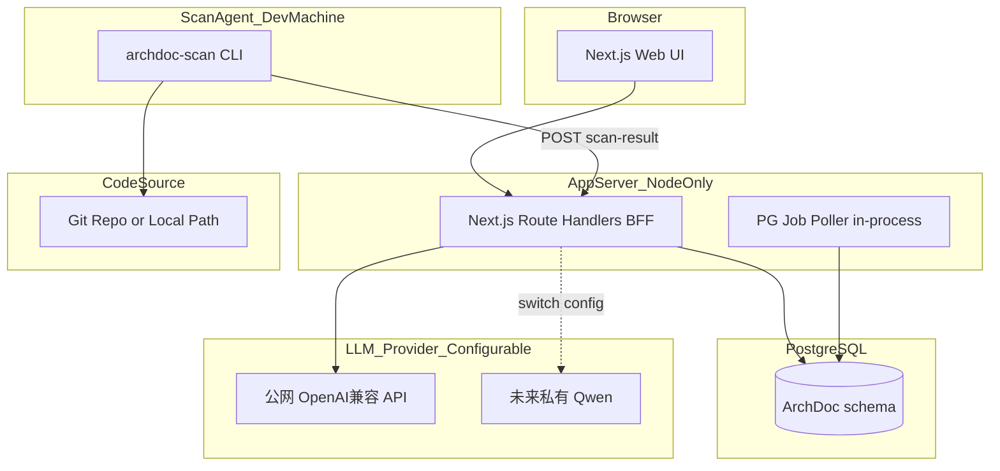
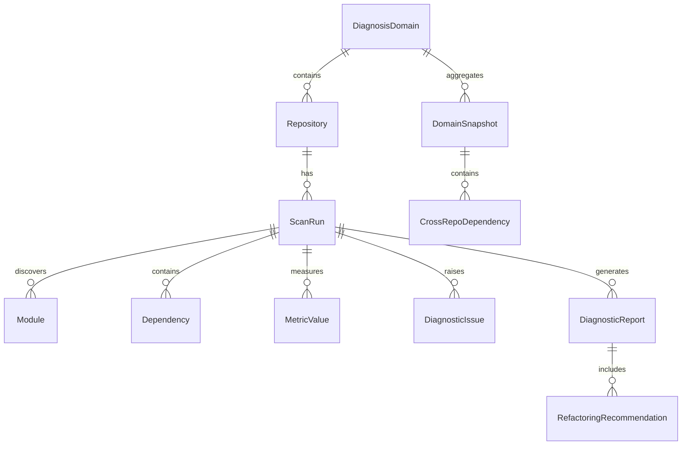
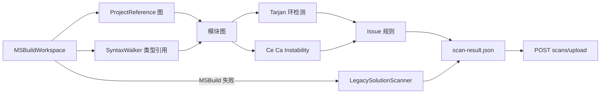
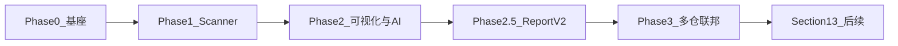

# ArchDoc 架构诊断 APP — 完整方案与进度追踪

> **Living Document**：本文档为 ArchDoc 项目的权威方案与进度对照基准。  
> 沟通调整方案时请更新本文档，并在文末「变更记录」中注明日期与变更摘要。

| 元信息 | 值 |
|--------|-----|
| 文档版本 | 1.1 |
| 最后更新 | 2026-06-28 |
| 当前阶段 | **Phase 2.5 Report V2**（R2-A～R2-C 实施中） |
| MVP 交付线 | Phase 2 — **已验收通过** |
| 关联文档 | [ARCHITECTURE.md](./ARCHITECTURE.md) · [DEPLOYMENT.md](./DEPLOYMENT.md) · [README.md](../README.md) |

---

## 目录

1. [产品愿景与核心价值](#1-产品愿景与核心价值)
2. [MVP 边界与功能优先级](#2-mvp-边界与功能优先级)
3. [目标架构](#3-目标架构)
4. [仓库结构](#4-仓库结构)
5. [核心数据模型](#5-核心数据模型)
6. [scan-result.json 契约](#6-scan-resultjson-契约)
7. [Scanner 设计](#7-scanner-设计)
8. [BFF API 设计](#8-bff-api-设计)
9. [LLM 可配置层](#9-llm-可配置层)
10. [前端页面规划](#10-前端页面规划)
11. [多仓库联邦（Phase 3）](#11-多仓库联邦phase-3)
12. [实施路线图（10 周）](#12-实施路线图10-周)
13. [风险与对策](#13-风险与对策)
14. [后续扩展（Section 13）](#14-后续扩展section-13)
15. [实现进度追踪](#15-实现进度追踪)
16. [方案 vs 实现差异](#16-方案-vs-实现差异)
17. [变更记录](#17-变更记录)
18. [Report V2 产品规格](#18-report-v2-产品规格)

---

## 1. 产品愿景与核心价值

### 一句话定位

**ArchDoc 是企业内可部署的「多仓库 .NET 架构联邦诊断台」——用 Roslyn 提取可验证的代码事实，用 LLM 生成带证据链的重构与绞杀者迁移建议。**

### 背景

面向运行多年的 C#/.NET MES 单体系统：代码库庞大、文档缺失、耦合严重、设计意图模糊。团队希望通过 AI 辅助架构诊断，识别模块耦合与架构坏味道，获得可落地的重构建议，并以**绞杀者模式（Strangler Fig）**逐步拆解为微服务。

### 核心价值

| 痛点 | ArchDoc 如何解决 |
|------|------------------|
| 代码库庞大、文档缺失 | 自动扫描 Solution/Project，生成模块地图与依赖图 |
| 耦合严重但说不清 | 量化耦合指标 + 架构坏味道规则 + AI 解释 |
| 重构方向缺乏共识 | 基于指标排序的重构建议，附证据链 |
| 不敢拆单体 | 绞杀者候选评分 + 分阶段迁移路径 |
| 人工架构评审成本高 | 可重复扫描，支持基线对比与 CI 门禁（后续） |

### 部署约束（修订后）

| 维度 | 约束 |
|------|------|
| 系统形态 | 1~N 个 .NET 服务，分布在多个 Git 仓库 |
| 部署环境 | 企业内网，无外部 SaaS 依赖 |
| AI | 当前公网 OpenAI 兼容 API 测试；生产切换私有 Qwen |
| 中间件 | **仅 PostgreSQL + Node.js**，不引入 Redis/Docker/Neo4j |
| 扫描方式 | 内网 Agent 本地扫描 + 上报，代码不出网 |

---

## 2. MVP 边界与功能优先级

### MVP 范围（已确认：Phase 2 为交付线）

| 包含 | 不包含（后续迭代） |
|------|------------------|
| Scanner CLI 扫描单仓 `.sln` 并上报 | CI 门禁、自动 PR |
| 诊断域 / 仓库 / 扫描任务 CRUD | NDepend 导入 |
| 指标计算 + Issue 规则引擎 | pgvector RAG（先用结构化摘要） |
| 依赖图 + 仪表盘 | LDAP 鉴权（MVP 用 API Key） |
| **可配置公网 LLM** 项目级诊断报告 | — |

**LLM 策略：** 抽象 `LlmProvider`，MVP 默认 OpenAI 兼容 API；生产切换私有 Qwen 仅改配置，不改业务代码。

### 功能优先级（P0 → P1 → P2）

| 优先级 | 功能 | 方案状态 | 实现状态 | 验证状态 |
|--------|------|----------|----------|----------|
| **P0** | 项目接入（本地 Solution） | 必须 | ✅ | ✅ |
| **P0** | Roslyn 静态扫描 + 指标 | 必须 | ✅ | ✅ |
| **P0** | 依赖图 + Issue 规则 | 必须 | ✅ | ✅ |
| **P0** | AI 架构诊断报告 | 必须 | ✅ | ✅ |
| **P1** | 绞杀者候选评分（Top 5） | 部分 MVP | ✅ | ✅ |
| **P1** | 多仓联邦视图 | Phase 3 | ✅ 代码 | ⏳ 待验证 |
| **P1** | 快速开始向导 | 方案外增补 | ✅ | ✅ |
| **P2** | Git 集成自动扫描 | 后续 | ❌ | — |
| **P2** | CI 门禁 / ScanRun diff | 后续 | ❌ | — |
| **P2** | pgvector RAG | 后续 | ❌ | — |

图例：✅ 完成 · ⏳ 进行中 · ❌ 未开始

---

## 3. 目标架构



### 数据流

```
archdoc-scan → POST /api/v1/scans/upload → PostgreSQL
User → POST /api/v1/scans/:id/diagnose → job_queue → LLM → diagnostic_reports
Multi-scan → POST /api/v1/domains/:id/snapshot → cross_repo_dependencies
```

### 依赖白名单

- **服务端：** PostgreSQL 14+、Node.js 18+（Next.js standalone）
- **Agent 端：** .NET 8 SDK + 私有 NuGet
- **不引入：** Redis、Docker、Neo4j、Supabase、对象存储

---

## 4. 仓库结构

```
ArchDoc/
├── web/                          # Next.js 14 UI + BFF
│   ├── src/app/api/v1/           # REST API Route Handlers
│   ├── src/lib/db/               # pg 连接、queries、federation
│   ├── src/lib/llm/              # LlmProvider 抽象
│   ├── src/lib/jobs/             # diagnoseJob、job 轮询
│   ├── src/components/           # UI 组件（含 QuickStartWizard 等）
│   └── tests/                    # Vitest API 自动化测试
├── scanner/                      # .NET 8 解决方案
│   ├── ArchDoc.Scanner/          # Roslyn + LegacySolutionScanner
│   ├── ArchDoc.Metrics/          # 环检测、Ce/Ca、分层违规
│   └── ArchDoc.Cli/              # archdoc-scan CLI
├── packages/
│   └── scan-result.schema.json   # 扫描产物 JSON Schema v1
├── db/migrations/                # 001_init, 002_jobs, 003_domain_name_unique
└── docs/
    ├── MASTER_PLAN.md            # 本文档
    ├── ARCHITECTURE.md
    └── DEPLOYMENT.md
```

---

## 5. 核心数据模型



### 核心表

| 表 | 用途 |
|----|------|
| `diagnosis_domains` | 诊断域（诊断项目） |
| `repositories` | Git/本地仓库注册 |
| `scan_runs` | 扫描任务状态、artifact |
| `modules` | Project 节点 |
| `dependencies` | 模块间有向边 |
| `metric_values` | M01–M06 指标快照 |
| `diagnostic_issues` | 规则引擎 Issue |
| `diagnostic_reports` | LLM 报告 JSONB |
| `refactoring_recommendations` | 结构化建议 |
| `app_settings` | LLM 多模型配置 |
| `job_queue` | 异步任务（AI 诊断） |
| `domain_snapshots` | Phase 3 跨仓快照 |
| `cross_repo_dependencies` | Phase 3 跨仓依赖边 |

---

## 6. scan-result.json 契约

Schema 文件：[`packages/scan-result.schema.json`](../packages/scan-result.schema.json)

```json
{
  "schema_version": "1.0",
  "repository_id": "uuid",
  "solution_path": "Mes.Production.sln",
  "scanned_at": "ISO8601",
  "commit_sha": "optional",
  "modules": [{ "id": "mod-1", "name": "Mes.Production.Bll", "kind": "project", "loc": 45230 }],
  "dependencies": [{ "from": "mod-1", "to": "mod-2", "kind": "project_ref", "weight": 1 }],
  "package_refs": [{ "module_id": "mod-1", "package_id": "Mes.Common", "version": "2.1.0" }],
  "metrics": [{ "module_id": "mod-1", "code": "M01", "value": 18 }],
  "issues": [{ "rule_id": "CYCLE_SCC", "severity": "critical", "module_ids": ["mod-1"], "message": "..." }],
  "summaries": [{ "module_id": "mod-1", "top_types": ["OrderService"], "snippet": "..." }]
}
```

`summaries` 供 LLM 上下文使用，避免 RAG 向量库依赖。

---

## 7. Scanner 设计

**项目：** [`scanner/ArchDoc.sln`](../scanner/ArchDoc.sln)

### CLI 用法

```powershell
cd scanner
dotnet run --project ArchDoc.Cli -- `
  --solution D:\path\to\Your.sln `
  --repository-id <uuid> `
  --api-url http://localhost:3000/api/v1 `
  --api-key dev-secret-key `
  [--output scan-result.json] `
  [--diagnose] `
  [--no-upload]
```

**无需 UUID 的简化用法（方案外增补）：**

```powershell
dotnet run --project ArchDoc.Cli -- `
  --solution D:\path\to\Your.sln `
  --domain-id <诊断项目UUID> `
  --repo-name "MyRepo" `
  --api-url http://localhost:3000/api/v1 `
  --api-key dev-secret-key
```

### 扫描管道



### 指标

| 代码 | 名称 |
|------|------|
| M01 | Ce 传出耦合 |
| M02 | Ca 传入耦合 |
| M03 | Instability |
| M04 | 循环依赖（SCC） |
| M05 | 跨层违规 |
| M06 | 类 Fan-out |

### 降级模式

| 模式 | 触发条件 | 能力 |
|------|----------|------|
| Roslyn 标准扫描 | SDK 风格 .csproj 可加载 | 完整深度规则 |
| Legacy 兼容扫描 | .NET Framework 旧式项目 MSBuild 失败 | 结构/依赖/LOC/NuGet，部分规则跳过 |
| `--dll-mode`（方案预留） | MSBuild 完全不可用 | 仅分析已编译程序集 |

---

## 8. BFF API 设计

基路径：`/api/v1` · 写操作需 Header `X-Api-Key`

### 原计划端点

| 方法 | 路径 | 说明 |
|------|------|------|
| GET | `/health` | 健康检查 |
| GET | `/health/llm` | LLM 连接测试 |
| POST | `/domains` | 创建诊断域 |
| GET | `/domains/:id` | 域详情 + 仓库列表 |
| DELETE | `/domains/:id` | 删除诊断域 |
| POST | `/repositories` | 注册仓库 |
| POST | `/scans/upload` | Scanner 上报 |
| GET | `/scans/:id` | 扫描详情 |
| GET | `/scans/:id/graph` | 依赖图 JSON |
| GET | `/scans/:id/issues` | Issue 列表 |
| POST | `/scans/:id/diagnose` | 触发 AI 诊断 |
| GET | `/reports/:id` | 获取报告 |
| POST | `/domains/:id/snapshot` | 创建跨仓快照 |
| GET | `/jobs/poll` | 后台任务轮询 |

### 方案外增补端点

| 方法 | 路径 | 说明 |
|------|------|------|
| GET/PUT | `/settings/llm` | 多模型 LLM 配置 |
| POST | `/settings/llm/test` | 测试指定模型 |
| POST | `/domains/quick-start` | 一次创建诊断项目 + 仓库 |
| GET | `/repositories/:id/scans/latest` | 轮询最新扫描（快速开始用） |
| GET | `/jobs/:id` | 查询单个 job 状态 |
| POST | `/auth/verify` | API Key 验证 |

---

## 9. LLM 可配置层

### 配置方式

1. **UI 优先：** `/settings` → 大模型配置（存 `app_settings` 表）
2. **环境变量兜底：** `web/.env.local` 见 `.env.example`

### 模型策略（两阶段）

| 阶段 | 模型数量 | 说明 |
|------|----------|------|
| 当前公网测试 | **1 个** | 架构诊断主模型（DeepSeek / GPT-4o 等） |
| 未来全内网生产 | **1～2 个** | 内网 Qwen 主模型 + 可选备用 |

### 诊断 Prompt 流程

1. 从 PG 聚合 Top 15 模块 metrics + Top 10 issues + summaries
2. System Prompt：Facts-only + 必须引用 evidence
3. JSON 输出：`summary`, `risks[]`, `quick_wins[]`, `refactoring_recommendations[]`
4. evidence 校验；失败重试 1 次，仍失败标记 partial

**隐私原则：** 仅上传 metrics / issues / summaries，**不上传完整源码**。

---

## 10. 前端页面规划

### 原计划路由

| 路由 | 功能 |
|------|------|
| `/` | 诊断域列表 |
| `/domains/[id]` | 健康分、雷达图、Top 风险、快照入口 |
| `/domains/[id]/repositories` | 仓库管理 |
| `/domains/[id]/scans/[scanId]` | 扫描详情、AI 诊断、绞杀者 Top 5 |
| `/domains/[id]/scans/[scanId]/graph` | Cytoscape 依赖图 |
| `/domains/[id]/scans/[scanId]/issues` | Issue 清单 |
| `/domains/[id]/scans/[scanId]/reports/[reportId]` | AI 报告 Markdown |
| `/domains/[id]/federation` | 跨仓联邦图（Phase 3） |
| `/settings` | 系统设置、LLM 配置 |

### 方案外增补路由

| 路由 | 功能 |
|------|------|
| `/quick-start` | 3 步快速开始向导（创建 → 扫描 → 查看） |

### 典型用户流程

**标准流程（30 分钟）：**

1. 创建诊断域 → 注册仓库 → 运行 Scanner 上传
2. 查看仪表盘 + 依赖图 + 问题清单
3. 生成 AI 诊断报告 → 阅读报告

**快速开始流程（方案外增补）：**

1. `/quick-start` 填写项目名称 + `.sln` 路径
2. 复制预填 Scanner 命令执行，或上传 JSON
3. 等待扫描完成 → 自动跳转（可选自动 AI 诊断）

---

## 11. 多仓库联邦（Phase 3）

### 设计逻辑

`domain_snapshots` 聚合同一诊断域内多个仓库的已完成扫描，分析**跨仓库依赖**。

**跨仓依赖识别：** 比对各仓 `package_refs` 与同 Domain 内模块 `AssemblyName` / `PackageId` 映射。

### Phase 3 验收标准

> 3 仓联合诊断 + 跨仓 Issue + 绞杀者 Top5

### 验证操作路径

1. 在诊断项目下注册 2+ 仓库并分别扫描
2. 诊断项目首页 **「创建跨仓库快照」**
3. 打开 `/domains/[id]/federation` 查看跨仓依赖图
4. （可选）对快照触发联合 AI 诊断

---

## 12. 实施路线图（10 周）



| Phase | 周次 | 目标 | 代码 | 验证 |
|-------|------|------|------|------|
| **Phase 0** 基座 | 1–2 | PG 迁移、Next.js BFF、health、API Key | ✅ | ✅ |
| **Phase 1** Scanner | 3–4 | Roslyn CLI、upload 管道、指标/Issue API | ✅ | ✅ |
| **Phase 2** AI 诊断 | 5–7 | 仪表盘、依赖图、LLM 报告 — **MVP 交付线** | ✅ | ✅ |
| **Phase 2.5** Report V2 | — | 可验证架构解读报告、结构页、Scanner 深读 | 🔄 实施中 | ⏳ |
| **Phase 3** 联邦 | 8–10 | 跨仓快照、联邦图、联合诊断 | ✅ | ⏳ 待做 |
| **Section 13** | 11+ | RAG、CI、LDAP、ScanRun diff | ❌ | — |

### 各 Phase 验收标准

| Phase | 验收标准 | 验收日期 |
|-------|----------|----------|
| Phase 0 | `npm run dev` 可连 PG，`GET /health` 返回 ok | 2026-06 |
| Phase 1 | 样本 `.sln` 扫描，Web 展示模块与依赖 | 2026-06-28 |
| Phase 2 | 30 分钟内扫描到 AI 报告；依赖图、绞杀者 Top 5 可用 | **2026-06-28** |
| Phase 3 | 3 仓联合诊断 + 跨仓 Issue + 绞杀者 Top5 | 待定 |

---

## 13. 风险与对策

| 风险 | 对策 | 实现状态 |
|------|------|----------|
| MSBuild 环境不一致 | SDK 版本文档化；Legacy 回退扫描 | ✅ Legacy 已实现 |
| 公网 LLM 代码隐私 | 仅上传 metrics/issues/summaries | ✅ |
| AI 幻觉 | evidence 校验 + partial 标记 | ✅ |
| 大图性能 | Cytoscape clustering | 部分 |
| 扫描慢 | 异步 ScanRun；Progress 日志 | 部分 |
| 旧式 .NET Framework 项目 | LegacySolutionScanner 回退 | ✅ |

---

## 14. 后续扩展（Section 13）

Phase 3 验收通过后排期：

| 项 | 说明 | 状态 |
|----|------|------|
| pgvector RAG | Qwen Embedding 就绪后接入 | ❌ |
| Git churn | 变更频率纳入 StranglerScore | ❌ |
| CI 模板 | GitHub Action / Azure DevOps Task | ❌ |
| LDAP / SSO | 企业鉴权 | ❌ |
| ScanRun diff | 基线对比、CI 门禁 | ❌ |
| LLM fallback | 主模型失败自动切备用 | UI 已预留，逻辑未接 |
| `--dll-mode` | 纯 DLL 降级扫描 | ❌ |

---

## 15. 实现进度追踪

### 当前焦点

**Phase 2.5 Report V2** — 提升报告结构可读性、意图推断与证据可验证性（优先于 Phase 3）

### 待办清单

| ID | 任务 | 优先级 | 状态 |
|----|------|--------|------|
| R2-A | structureFacts + Prompt V2 + EvidencePanel | P0 | ✅ |
| R2-B | `/architecture` 结构页 + 模块级报告 | P1 | ✅ |
| R2-C | Scanner schema 1.1 深读规则 | P1 | ✅ |
| T1 | Phase 3：注册 2+ 仓库、创建跨仓快照、验证联邦图 | P1 | ⏳ 待做 |
| T2 | Phase 3：跨仓 Issue + 联合 AI 诊断 | P2 | ⏳ 待做 |
| T3 | 运行 `npm run test:api` 确认 Vitest 通过 | P2 | ⏳ 可选 |
| T4 | 内网生产部署（见 DEPLOYMENT.md） | P2 | ❌ |
| T5 | Section 13 后续扩展 | P3 | ❌ |

### Phase 2 验收记录（2026-06-28）

用户确认以下功能正常：

- ✅ AI 诊断报告已成功输出，可正常查看
- ✅ 依赖图可正常使用
- ✅ 绞杀者候选（Top 5）可正常使用

**→ MVP（Phase 2）正式验收通过。**

### 测试环境快照

| 项目 | 值 |
|------|-----|
| 诊断项目 | iMES |
| 扫描样本 | iMES.Net（12 模块 / 36 依赖） |
| LLM | DeepSeek（公网测试） |
| 最新代码 commit | `80617b3`（已 push GitHub） |

---

## 16. 方案 vs 实现差异

> 对照最初方案（Phase 2 MVP 边界）与当前代码库的差异，便于评审与决策。

### 超出原方案已实现

| 功能 | 说明 | 关键文件 |
|------|------|----------|
| 快速开始向导 | `/quick-start` 3 步流程 | `web/src/app/quick-start/` |
| CLI 自动注册仓库 | `--domain-id` + `--repo-name` | `scanner/ArchDoc.Cli/Program.cs` |
| CLI 自动诊断 | `--diagnose` 上传后触发 AI | 同上 |
| Legacy 扫描器 | .NET Framework 旧项目兼容 | `scanner/ArchDoc.Scanner/LegacySolutionScanner.cs` |
| JSON 上传 | UI 直接上传 scan-result.json | `web/src/components/UploadScanJson.tsx` |
| 扫描轮询 | 等待 Scanner 上传完成 | `web/src/components/ScanWaitPanel.tsx` |
| 多模型 LLM 配置 | UI 管理多个 OpenAI 兼容模型 | `web/src/components/LlmSettingsPanel.tsx` |
| Vitest API 测试 | 21 端点自动化测试套件 | `web/tests/` |
| 诊断域删除 | 级联删除 | `web/src/app/DeleteDomainButton.tsx` |
| Phase 3 UI | 联邦图页面（原方案 Phase 2 不含） | `web/src/app/domains/[id]/federation/` |

### 原方案有但未实现

| 功能 | 原方案位置 | 备注 |
|------|-----------|------|
| `--dll-mode` | Scanner 降级模式 | 仅有 Legacy 文本解析回退 |
| shadcn/ui | 前端 UI 栈 | 使用自研 Tailwind 组件 |
| Markdown 报告导出 | Phase 2 验收 | 页面渲染已有，导出按钮待确认 |
| drizzle-orm | Phase 0 首周 | 使用原生 `pg` |
| 模块级独立诊断报告 | MVP 范围描述 | ✅ Report V2 module 类型 |

### 原方案范围修订

| 原描述 | 修订后 |
|--------|--------|
| MVP 不含多仓联邦 UI | Phase 3 代码已提前实现，验证待做 |
| MVP 不含 Phase 3 | 代码已完成，当前处于验证阶段 |

---

## 17. 变更记录

| 日期 | 版本 | 变更摘要 | 变更人 |
|------|------|----------|--------|
| 2026-06-28 | 1.0 | 初始版本：整合完整方案 + 进度追踪 + 方案差异对照；Phase 2 验收通过，当前 Phase 3 | — |
| 2026-06-28 | 1.1 | 新增 §18 Report V2；插入 Phase 2.5 路线图；当前焦点调整为 Report V2 实施 | — |

---

## 18. Report V2 产品规格

> 针对「看不出结构、看不出意图、内容少、无法验证」四类痛点，将报告从「轻量 AI 摘要」升级为「可验证的架构解读」。

### 设计原则

1. **Facts First** — 70% 来自 Scanner 确定性输出
2. **Structure Before Opinion** — 先结构、后风险
3. **Intent as Hypothesis** — 意图推断标注置信度
4. **Click to Verify** — 证据可点击跳转

### 报告章节（V2）

| 章节 | 类型 | 说明 |
|------|------|------|
| A. 架构总览 | 事实 | 模块数、LOC、分层分布、健康分 |
| B. 模块结构 | 事实 | 分层分组 + 依赖关系 |
| C. 关键依赖链 | 事实 | Top 高风险链路 |
| D. 模块职责表 | 混合 | 职责推断 + 关键类型 |
| E. 架构坏味道 | 事实 | Issue 解读 |
| F. 设计意图推断 | 推断 | Bounded context 假设 |
| G. 风险与重构 | 混合 | risks / recommendations |
| H. 绞杀者路线图 | 混合 | 分阶段拆分建议 |

### 实施分期

| 分期 | 内容 | 状态 |
|------|------|------|
| R2-A | structureFacts、Prompt V2、EvidencePanel | 🔄 |
| R2-B | `/architecture` 页、模块级 report | 🔄 |
| R2-C | scan-result 1.1、God Class 等深读规则 | 🔄 |
| R2-D | 人工反馈、可信度评分 | ❌ 远期 |

### 验收标准

1. 5 分钟内能说出 Solution 分层与 3 条关键依赖链
2. Top 模块有职责推断 + 置信度
3. project 报告 ≥ 8 个有效章节
4. ≥ 80% 风险条目可一键跳转 fact 来源
5. 无 Issue 时不编造 critical 风险

---

## 附录：沟通时如何更新本文档

调整方案时，请同步更新以下章节：

1. **§2 MVP 边界** — 范围增减
2. **§12 路线图** — Phase 状态变更
3. **§15 进度追踪** — 待办与验收记录
4. **§16 方案差异** — 新增实现或偏差
5. **§17 变更记录** — 追加一行日期 + 摘要

在 Cursor 中可直接说：「按 MASTER_PLAN 更新方案，xxx 改为 yyy」。
